# OA Portal

Benvenuto nell'**Osteoarthritis Portal**!  
Questa applicazione offre una piattaforma intuitiva per medici e pazienti per la gestione di immagini radiografiche del ginocchio, integrando funzionalità avanzate di machine learning per migliorare l'analisi delle immagini.

---

## Funzionalità

- **Registrazione Utente**: Crea un nuovo account per accedere al sistema.
- **Login Utente**: Accedi con le tue credenziali.
- **Gestione Immagini**: Carica, visualizza e analizza immagini radiografiche.
- **Analisi Automatizzata**: Modello di machine learning per il riconoscimento e la classificazione delle immagini.
- **Design Responsive**: Adatto sia a desktop che dispositivi mobili.

### Interfaccia principale
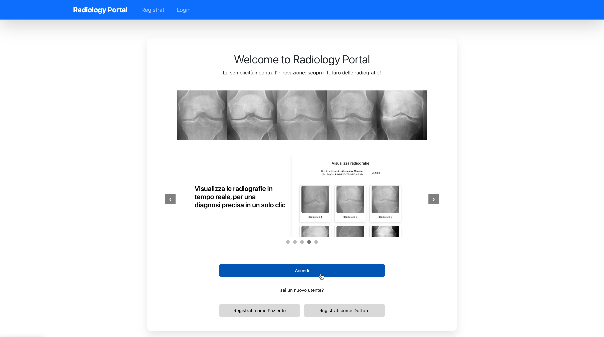


### Registrazione
<div align="center">
  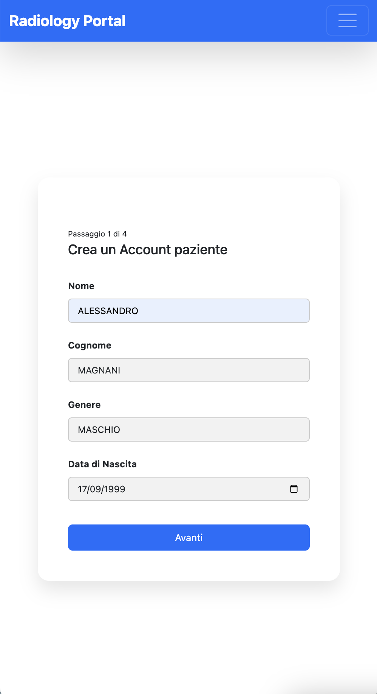
  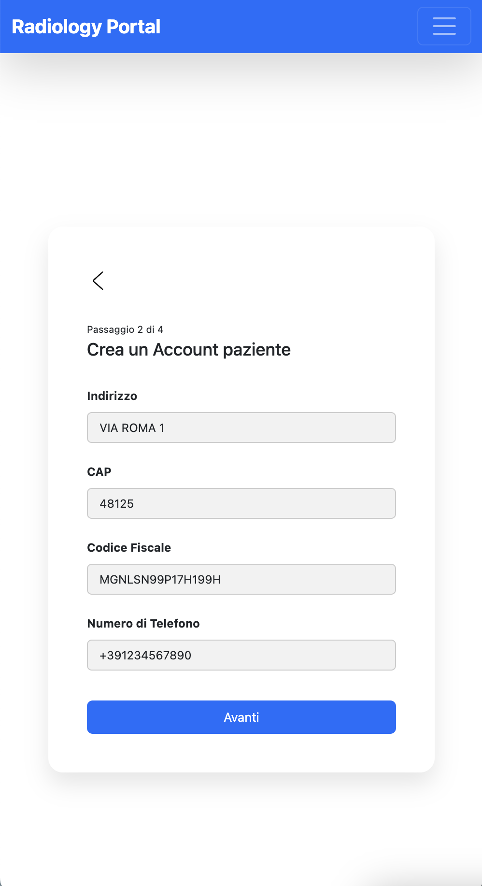
  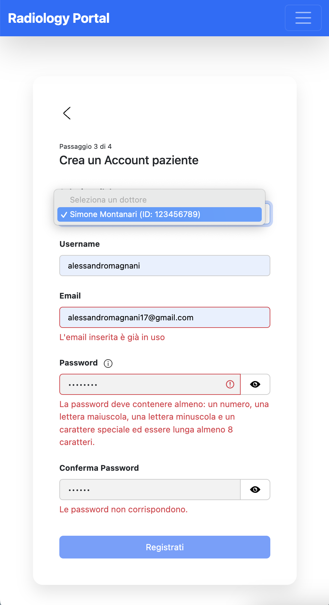
  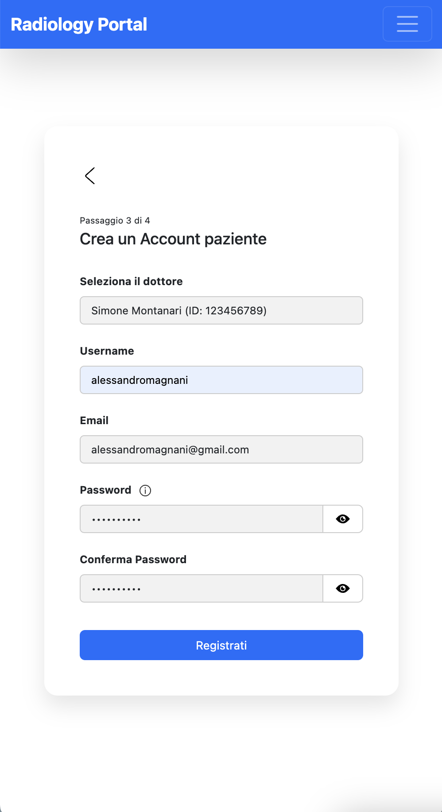
  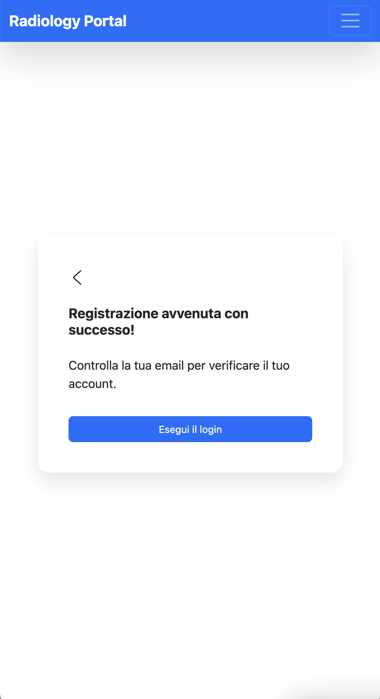
</div>

### Visualizzazione dati e radiografie
<div align="center">
  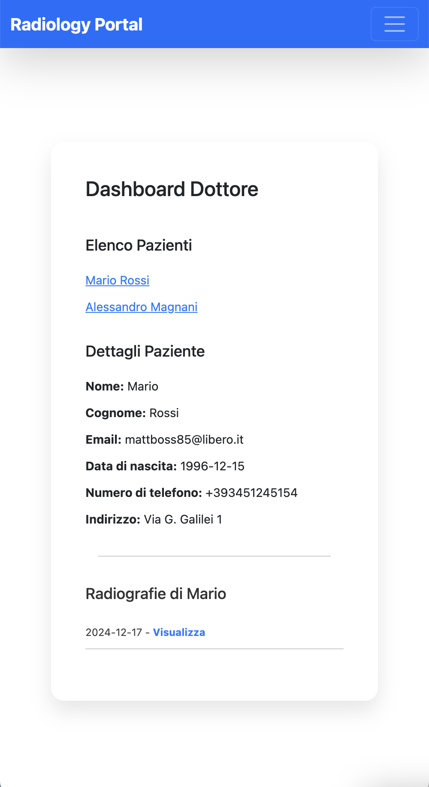
  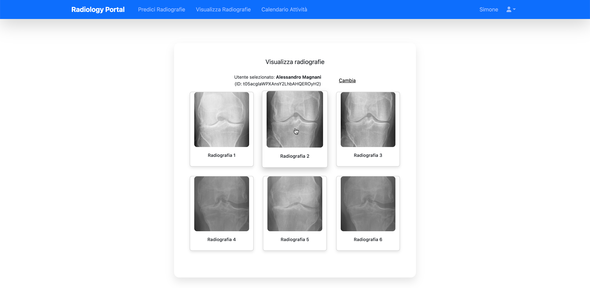
</div>


### Predizione radiografie
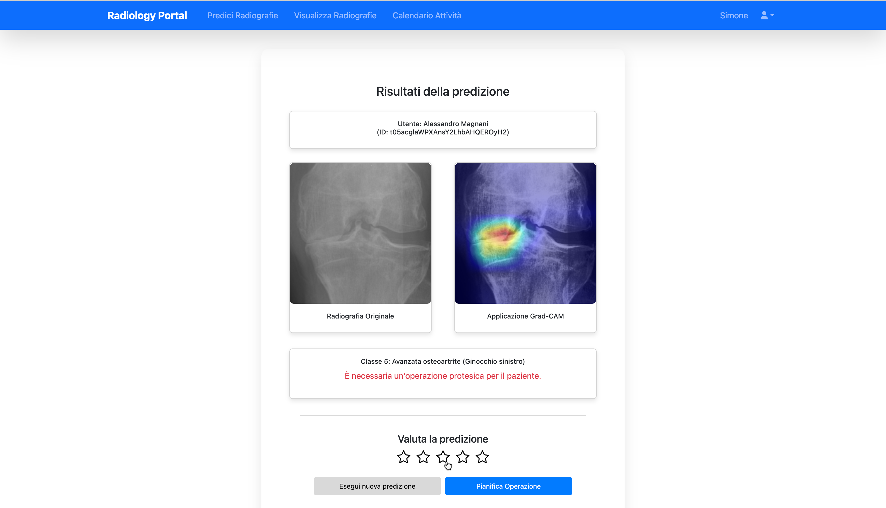

### Calendario
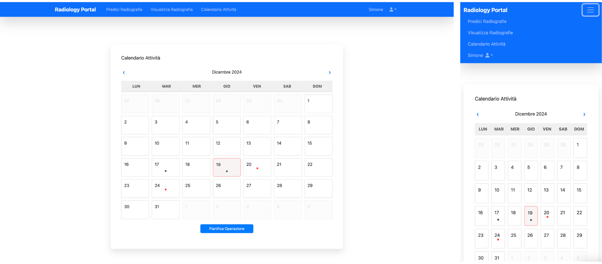

### Sezione notifiche
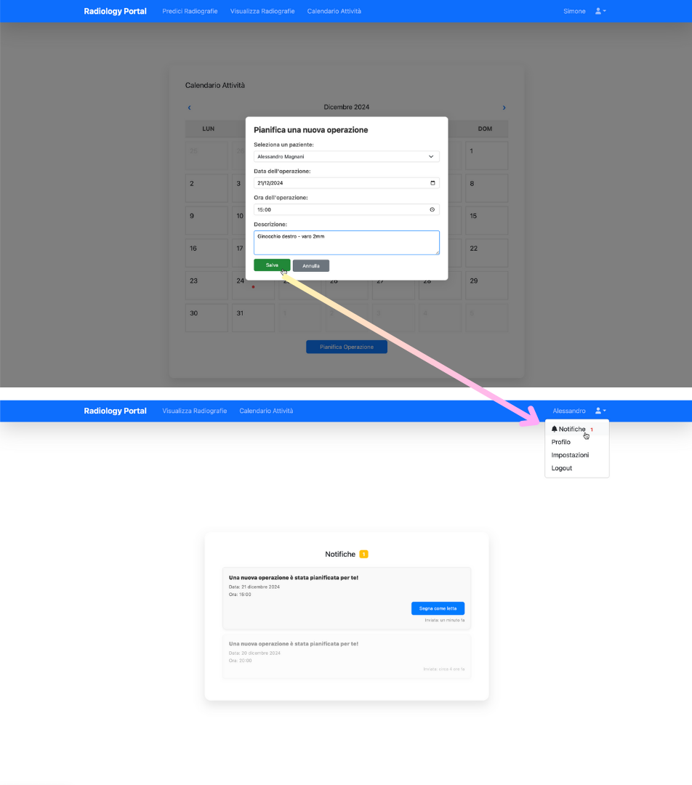

---

## Tecnologie Utilizzate

### Frontend
- **Vue.js**: Framework per la costruzione di interfacce utente interattive.

### Backend
- **Node.js**: Runtime JavaScript lato server.  
- **Express.js**: Framework web per la gestione delle API.

### Database e Cloud
- **Firestore**: Database NoSQL per l'archiviazione dei dati.  
- **Google Cloud Storage**: Storage per i file immagine.  
- **Google Compute Engine**: Macchina virtuale per il deployment.

### Machine Learning
- **Vertex AI**: Piattaforma per l'addestramento e il deployment dei modelli.  
- **Job Scheduler**: Automazione per il riaddestramento periodico del modello.

---

## Struttura del Progetto

La struttura principale del progetto è la seguente:

- `osteoarthritis-project/`
  - `backend/` - Codice del server backend
    - `app.js` - Punto di ingresso dell'applicazione Node.js
    - `routes/` - Definizione delle rotte API
    - `models/` - Modelli dei dati
    - `controllers/` - Logica di gestione delle richieste
  - `frontend/` - Codice dell'applicazione frontend
    - `src/`
      - `components/` - Componenti Vue.js
      - `views/` - Pagine dell'applicazione
      - `assets/` - Risorse statiche (immagini, CSS)
  - `docker-compose.yml` - Configurazione per Docker Compose
  - `README.md` - Documentazione del progetto

---

## Configurazione e Installazione

1. **Clona il repository**:

   ```bash
   git clone https://github.com/alessandromagnani17/osteoarthritis-project.git
   cd osteoarthritis-project

2. **Configura le variabili d'ambiente**:  
   Crea un file `.env` nelle directory `backend` e `frontend` con le credenziali necessarie per Firestore e Google Cloud Storage.  

3. **Avvia i servizi con Docker**:
   ```bash
   docker-compose up --build

---

## Deployment

Il progetto è configurato per il deployment su **Google Compute Engine** con Docker.

1. **Crea una macchina virtuale** su Google Compute Engine.

2. **Installa Docker** nella VM.

3. **Clona il repository sulla VM**:

   ```bash
   git clone https://github.com/alessandromagnani17/osteoarthritis-project.git
   cd osteoarthritis-project

4. **Esegui i container**:
   ```bash
    docker-compose up --build -d

---

## Machine Learning: Retraining del Modello

Il modello di machine learning viene riaddestrato periodicamente per migliorare la precisione.

1. **Vertex AI**: Configura il modello per l'addestramento su Vertex AI.
2. **Job Scheduler**: Utilizza Google Cloud Scheduler per pianificare job periodici.
   
---

## Autori

- [Alessandro Magnani](https://github.com/alessandromagnani17)
- [Andrea Matteucci](https://github.com/andreamatteucci)
- [Simone Montanari](https://github.com/zimon99)


